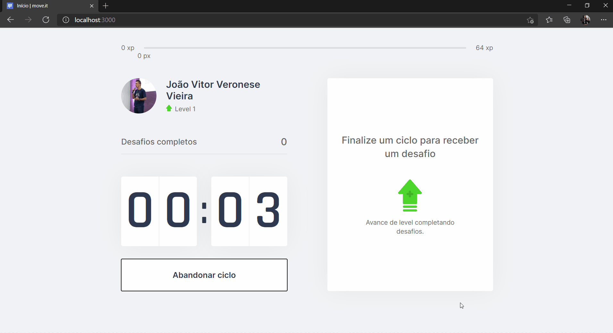
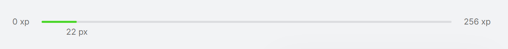
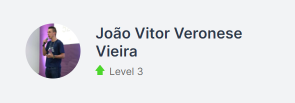
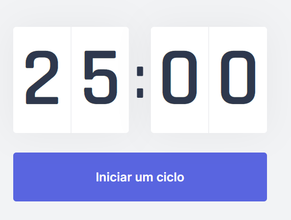
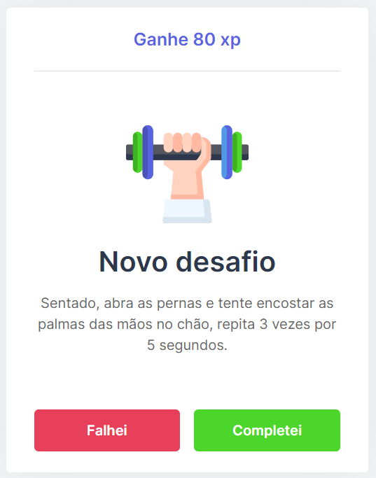

# #NLW4 - move.it

<figure>
  

    
    <figcaption>
      
        <blockquote>Next Level Week 4: é uma semana de ensino e estudo gratuito ministrada pela @rocketseat (eu participei da Trilha: React.js). Nas seções abaixo, você encontra mais detalhes sobre o move.it! :rocket:</blockquote>
      
    </figcaption>
  

</figure>

---

  
  
  
  

  <a href="#boom-apresentação">Apresentação</a>&nbsp;&nbsp;&nbsp;|&nbsp;&nbsp;&nbsp;
  <a href="#books-tecnologias">Tecnologias</a>&nbsp;&nbsp;&nbsp;|&nbsp;&nbsp;&nbsp;
  <a href="#microscope-futuro">Futuro</a>

  

## :boom: Apresentação

> A aplicação desenvolvida consiste na junção da [técnica de Pomodoro](https://brasilescola.uol.com.br/dicas-de-estudo/tecnica-pomodoro-que-e-e-como-funciona.htm) com a intenção de incentivar pessoas que passam muito tempo na frente do computador a realizar exercícios (especialmente para os olhos e para o corpo). Por isso, a cada 25 minutos, um notificação (visual e sonora) avisa o usuário de que está na hora de **movimentar-se**! :laughing:

### Barra de Progresso

Como *header* da aplicação, uma barra de progresso é exibida para informar ao usuário quanto xp ele já obteve naquele nível e quanto falta para que ele evolua para o próximo. O cálculo utilizado para determinar quão difícil é um nível foi feito com o **fator 4 de dificuldade** e consiste nesta fórmula: `((nivelAtual + 1) * 4) ^ 2`.

  

### Perfil

A seção de perfil apresenta o nome do usuário que está utilizando a aplicação, sua foto de perfil (estática, até o momento) e o nível que ele alcançou em virtude dos desafios concluídos.

  

### Contador

Este pode ser considerado o componente "coração" da aplicação, uma vez que é seu funcionamento que define todos os demais dados do sistema. Atualmente, ele está configurado para executar intervalos de **25 minutos**. Toda vez que esse ciclo é finalizado, um novo desafio randômico é exibido no [Card de Desafio](#card).

  

### Card de Desafio

Neste card, um desafio novo é exibido e o usuário informa de concluiu a tarefa ou falhou. Sempre que concluir, o usuário recebe o xp equivalente aquele desafio e, desta forma, pode continuar subindo de nível.

  

## :books: Tecnologias

- [React.js](https://reactjs.org/)
- [Next.js](https://nextjs.org/)
- [js-cookie](https://github.com/js-cookie/js-cookie)
- [CSS Modules](https://github.com/css-modules/css-modules)
- [API Notificações](https://developer.mozilla.org/pt-BR/docs/Web/API/Notification)
- [API Áudio](https://developer.mozilla.org/en-US/docs/Web/API/HTMLAudioElement/Audio)
- [Vercel (para deploy)](https://vercel.com/dashboard)
- [GIT](https://git-scm.com/)
- [ScreenToGif](https://www.screentogif.com/)
- [HTML](https://developer.mozilla.org/pt-BR/docs/Web/HTML)

## :microscope: Futuro

> Como experiência pessoal, foi muito engrandecedor participar deste evento e poder criar, em apenas 5 dias, uma aplicação como essa que, apesar de parecer simples, contém diversos conceitos e boas práticas úteis em qualquer projeto. Porém, como qualquer sistema, ainda é possível evoluir este e algumas sugestões de próximos passos são:

- [ ] Tornar a aplicação responsiva com @media-queries
- [ ] Adicionar funcionalidade de PWA
- [ ] Criar tema customizado
- [ ] Adicionar suporte à *light mode*
- [ ] Fazer autenticação com GitHub
- [ ] Criar um Leaderboard (ranking) com todos participantes
- [ ] Criar funcionalidade para compartilhar a evolução no Twitter
- [ ] Criar páina de configuração para poder definir:
  - O tempo de intervalo padrão para os exercícios
  - A mensagem da notificação
  - O som da notificação

Feito com :dart: por <a href="https://www.linkedin.com/in/jo%C3%A3o-vitor-veronese-vieira/" target="_blank" rel="noopener noreferrer">João Vitor Veronese Vieira</a> :boy:

